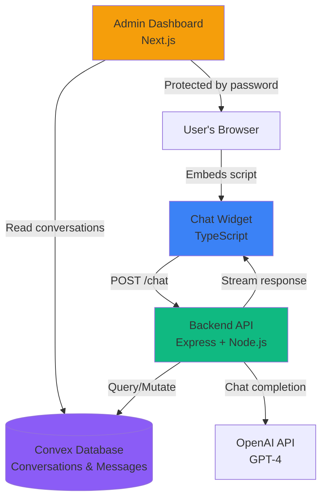

# Architecture Overview

Open Chat Widget is a full-stack application built with modern technologies. This guide explains how each component works and how they communicate.

## System Diagram



## Components

### 1. Chat Widget (Frontend)

**Location**: `widget/src/index.ts`

**Technology**: Vanilla TypeScript compiled to a single JavaScript bundle

**Purpose**: Embeddable UI that website visitors interact with

<Info>
The widget is framework-agnostic and works on any website - WordPress, React, Vue, plain HTML, etc.
</Info>

#### Key Features

- **Self-contained**: Single `chat-widget.js` file with no dependencies
- **Configurable**: Read options from `data-*` attributes on the script tag
- **Session management**: Generates and stores unique session IDs in localStorage
- **Streaming support**: Processes NDJSON responses token-by-token
- **Responsive design**: Adapts to mobile and desktop screens
- **State persistence**: Remembers open/closed state across page reloads

#### Configuration

The widget reads configuration from the script tag:

```typescript widget/src/index.ts
type WidgetConfig = {
  apiUrl: string;           // Backend endpoint
  apiKey: string;           // Widget API key
  title: string;            // Header text
  welcomeMessage: string;   // Initial message
  inputPlaceholder: string; // Input field placeholder
  position: "left" | "right"; // Screen position
  accentColor: string;      // Primary color (hex)
};
```

Example from source code:

```html
<script
  src="http://localhost:4000/widget/chat-widget.js"
  data-api-url="http://localhost:4000/chat"
  data-api-key="change-me-widget-key"
  data-title="Support"
  data-welcome-message="Hey! How can I help?"
  data-position="right"
  data-accent-color="#0ea5e9"
  defer
></script>
```

#### Build Process

The widget is built with esbuild for maximum performance:

```javascript widget/esbuild.config.mjs
esbuild.build({
  entryPoints: ['src/index.ts'],
  bundle: true,
  minify: true,
  target: 'es2020',
  format: 'iife', // Immediately-invoked function expression
  outfile: 'dist/chat-widget.js'
});
```

### 2. Backend API (Server)

**Location**: `backend/src/server.ts`

**Technology**: Node.js with Express framework

**Purpose**: Process chat requests, manage OpenAI streaming, and enforce security

#### Core Responsibilities

<CardGroup cols={2}>
  <Card icon="lock">
    **Authentication**
    
    Validates API keys using timing-safe comparison
  </Card>
  
  <Card icon="gauge">
    **Rate Limiting**
    
    Tracks requests by IP address (30/min default)
  </Card>
  
  <Card icon="shield">
    **CORS Protection**
    
    Configurable origin allowlist
  </Card>
  
  <Card icon="file-code">
    **Widget Serving**
    
    Delivers compiled JavaScript bundle
  </Card>
</CardGroup>

#### Request Flow

When a user sends a chat message:

<Steps>
  <Step title="Validation">
    ```typescript backend/src/server.ts
    // Validate request body
    const chatRequestSchema = z.object({
      sessionId: z.string().regex(/^[A-Za-z0-9._:-]{1,128}$/),
      message: z.string().min(1).max(4000)
    });
    ```
  </Step>
  
  <Step title="Get or create conversation">
    ```typescript backend/src/server.ts
    // Query Convex for existing conversation or create new
    const conversationId = await convex.mutation(
      anyApi.conversations.getOrCreateConversation,
      { sessionId, now: Date.now() }
    );
    ```
  </Step>
  
  <Step title="Store user message">
    ```typescript backend/src/server.ts
    await convex.mutation(anyApi.conversations.addMessage, {
      conversationId,
      role: "user",
      content: message,
      createdAt: Date.now()
    });
    ```
  </Step>
  
  <Step title="Fetch conversation history">
    ```typescript backend/src/server.ts
    const history = await convex.query(
      anyApi.conversations.getHistoryForModel,
      { conversationId, limit: env.MAX_HISTORY_MESSAGES }
    );
    ```
  </Step>
  
  <Step title="Stream OpenAI response">
    ```typescript backend/src/server.ts
    const response = await fetch("https://api.openai.com/v1/chat/completions", {
      method: "POST",
      headers: {
        Authorization: `Bearer ${env.OPENAI_API_KEY}`,
        "Content-Type": "application/json"
      },
      body: JSON.stringify({
        model: env.OPENAI_MODEL,
        stream: true,
        messages: [
          {
            role: "system",
            content: "You are a concise and helpful AI assistant embedded in a support chat widget."
          },
          ...history
        ]
      })
    });
    ```
  </Step>
  
  <Step title="Forward tokens to client">
    ```typescript backend/src/server.ts
    // Parse OpenAI's SSE stream and convert to NDJSON
    writeStreamLine(res, { type: "start", conversationId });
    // For each token from OpenAI:
    writeStreamLine(res, { type: "token", token });
    // When complete:
    writeStreamLine(res, { type: "done", message: fullMessage, conversationId });
    ```
  </Step>
  
  <Step title="Persist assistant message">
    ```typescript backend/src/server.ts
    await convex.mutation(anyApi.conversations.addMessage, {
      conversationId,
      role: "assistant",
      content: finalMessage,
      createdAt: Date.now()
    });
    ```
  </Step>
</Steps>

#### API Endpoints

The backend exposes these routes:

| Method | Path | Purpose | Auth |
|--------|------|---------|------|
| `GET` | `/health` | Health check | None |
| `GET` | `/widget/chat-widget.js` | Widget bundle | None |
| `GET` | `/v1/openapi.json` | OpenAPI spec | None |
| `POST` | `/chat` | Streaming chat (legacy) | Widget API key |
| `POST` | `/v1/chat` | Non-streaming chat | Widget API key |
| `POST` | `/v1/chat/stream` | Streaming chat | Widget API key |
| `GET` | `/v1/admin/conversations` | List conversations | Admin API key |
| `GET` | `/v1/admin/conversations/:id` | Get conversation thread | Admin API key |

#### Security Features

<Accordion title="Rate Limiting">
  Implemented per IP address in `backend/src/server.ts:105-120`:
  
  ```typescript
  const rateLimitBuckets = new Map<string, RateLimitBucket>();
  
  function isWithinRateLimit(req: Request): boolean {
    const key = getClientIp(req);
    const now = Date.now();
    const existing = rateLimitBuckets.get(key);
    
    if (!existing || now > existing.resetAt) {
      rateLimitBuckets.set(key, {
        count: 1,
        resetAt: now + env.RATE_LIMIT_WINDOW_MS
      });
      return true;
    }
    
    existing.count += 1;
    return existing.count <= env.RATE_LIMIT_MAX_REQUESTS;
  }
  ```
</Accordion>

<Accordion title="API Key Validation">
  Uses timing-safe comparison to prevent timing attacks:
  
  ```typescript backend/src/server.ts:122-131
  function secureEquals(left: string, right: string): boolean {
    const leftBuffer = Buffer.from(left);
    const rightBuffer = Buffer.from(right);
    
    if (leftBuffer.length !== rightBuffer.length) {
      return false;
    }
    
    return timingSafeEqual(leftBuffer, rightBuffer);
  }
  ```
</Accordion>

<Accordion title="CORS Configuration">
  Configurable origin allowlist with production safety:
  
  ```typescript backend/src/server.ts:67-75
  const configuredOrigins = env.CORS_ORIGIN.split(",")
    .map((origin) => origin.trim())
    .filter(Boolean);
  const allowAllOrigins = configuredOrigins.includes("*");
  
  if (env.NODE_ENV === "production" && allowAllOrigins) {
    throw new Error("Refusing to start with CORS_ORIGIN='*' in production.");
  }
  ```
</Accordion>

<Accordion title="Security Headers">
  Added to every response:
  
  ```typescript backend/src/server.ts:350-359
  res.setHeader("X-Content-Type-Options", "nosniff");
  res.setHeader("X-Frame-Options", "DENY");
  res.setHeader("Referrer-Policy", "no-referrer");
  res.setHeader("Permissions-Policy", "camera=(), microphone=(), geolocation=()");
  if (env.NODE_ENV === "production") {
    res.setHeader("Strict-Transport-Security", "max-age=31536000; includeSubDomains");
  }
  ```
</Accordion>

### 3. Convex Database

**Location**: `convex/schema.ts`, `convex/conversations.ts`

**Technology**: Convex (serverless real-time database)

**Purpose**: Store and query conversations and messages

<Info>
Convex provides reactive queries, automatic scaling, and built-in TypeScript support.
</Info>

#### Schema

Two tables with indexes for efficient queries:

```typescript convex/schema.ts
export default defineSchema({
  conversations: defineTable({
    sessionId: v.string(),
    createdAt: v.number(),
    updatedAt: v.number(),
    lastMessage: v.optional(v.string())
  })
    .index("by_session_id", ["sessionId"])
    .index("by_updated_at", ["updatedAt"]),
  
  messages: defineTable({
    conversationId: v.id("conversations"),
    role: v.union(v.literal("user"), v.literal("assistant")),
    content: v.string(),
    createdAt: v.number()
  })
    .index("by_conversation_id", ["conversationId"])
    .index("by_conversation_id_created_at", ["conversationId", "createdAt"])
});
```

#### Key Functions

<CodeGroup>
```typescript Get or Create Conversation
// convex/conversations.ts:27-48
export const getOrCreateConversation = mutation({
  args: {
    sessionId: v.string(),
    now: v.number()
  },
  handler: async (ctx, args) => {
    const existing = await ctx.db
      .query("conversations")
      .withIndex("by_session_id", (q) => q.eq("sessionId", args.sessionId))
      .unique();
    
    if (existing) {
      return existing._id;
    }
    
    return await ctx.db.insert("conversations", {
      sessionId: args.sessionId,
      createdAt: args.now,
      updatedAt: args.now,
      lastMessage: ""
    });
  }
});
```

```typescript Add Message
// convex/conversations.ts:51-73
export const addMessage = mutation({
  args: {
    conversationId: v.id("conversations"),
    role: roleValidator,
    content: v.string(),
    createdAt: v.number()
  },
  handler: async (ctx, args) => {
    const messageId = await ctx.db.insert("messages", {
      conversationId: args.conversationId,
      role: args.role,
      content: args.content,
      createdAt: args.createdAt
    });
    
    // Update conversation with latest message
    await ctx.db.patch(args.conversationId, {
      updatedAt: args.createdAt,
      lastMessage: args.content.slice(0, 500)
    });
    
    return messageId;
  }
});
```

```typescript List Conversations
// convex/conversations.ts:75-92
export const listConversations = query({
  args: {},
  handler: async (ctx) => {
    const conversations = await ctx.db
      .query("conversations")
      .withIndex("by_updated_at")
      .order("desc")
      .collect();
    
    return conversations.map((conversation) => ({
      _id: conversation._id,
      _creationTime: conversation._creationTime,
      sessionId: conversation.sessionId,
      createdAt: conversation.createdAt,
      updatedAt: conversation.updatedAt,
      lastMessage: conversation.lastMessage ?? ""
    }));
  }
});
```
</CodeGroup>

### 4. Admin Dashboard

**Location**: `dashboard/`

**Technology**: Next.js 15 with React Server Components

**Purpose**: View and manage conversations

#### Features

- **Password authentication**: Simple login with `DASHBOARD_PASSWORD`
- **Conversation list**: Sorted by most recent activity
- **Thread viewer**: See full message history for each session
- **Responsive design**: Works on desktop and mobile

#### Key Pages

<Tabs>
  <Tab title="Login Page">
    ```typescript dashboard/app/login/page.tsx
    // Password-protected login form
    // Sets encrypted cookie on success
    ```
    
    Location: `/login`
  </Tab>
  
  <Tab title="Conversation List">
    ```typescript dashboard/app/page.tsx
    export default async function DashboardPage() {
      await requireAuth();
      const conversations = await listConversations();
      
      return (
        <main>
          <h1>Conversations</h1>
          {conversations.map(conversation => (
            <Link href={`/conversations/${conversation._id}`}>
              Session: {conversation.sessionId}
            </Link>
          ))}
        </main>
      );
    }
    ```
    
    Location: `/`
  </Tab>
  
  <Tab title="Thread Viewer">
    ```typescript dashboard/app/conversations/[id]/page.tsx
    // Fetch conversation and messages from Convex
    // Display chronological message list
    ```
    
    Location: `/conversations/:id`
  </Tab>
</Tabs>

#### Authentication Flow

```typescript dashboard/lib/auth.ts
import { cookies } from "next/headers";

export async function requireAuth() {
  const cookieStore = await cookies();
  const authCookie = cookieStore.get("dashboard-auth");
  
  if (!authCookie?.value) {
    redirect("/login");
  }
  
  // Verify encrypted cookie matches password hash
}
```

## Data Flow Example

Let's trace a complete user interaction:

<Steps>
  <Step title="User opens chat widget">
    - Widget loads from `http://localhost:4000/widget/chat-widget.js`
    - Creates or retrieves `sessionId` from localStorage: `"a1b2c3d4-..."`
    - Displays welcome message
  </Step>
  
  <Step title="User types message">
    - User enters: "What are your hours?"
    - Widget POSTs to `/chat`:
    
    ```json
    {
      "sessionId": "a1b2c3d4-...",
      "message": "What are your hours?"
    }
    ```
  </Step>
  
  <Step title="Backend processes request">
    - Validates API key: ✓
    - Checks rate limit: ✓
    - Queries Convex: Find or create conversation for `sessionId`
    - Stores user message in Convex
    - Fetches last 20 messages for context
  </Step>
  
  <Step title="OpenAI generates response">
    - Backend sends conversation history to OpenAI
    - OpenAI streams tokens: `"Our"`, `" support"`, `" hours"`, ...
    - Backend forwards each token as NDJSON:
    
    ```json
    {"type":"start","conversationId":"j57..."}
    {"type":"token","token":"Our"}
    {"type":"token","token":" support"}
    {"type":"done","message":"Our support hours are 9am-5pm EST.","conversationId":"j57..."}
    ```
  </Step>
  
  <Step title="Widget displays response">
    - Receives NDJSON stream
    - Shows typing indicator ("Thinking...")
    - Appends each token in real-time
    - Displays final message: "Our support hours are 9am-5pm EST."
  </Step>
  
  <Step title="Backend stores response">
    - Saves assistant message to Convex
    - Updates conversation's `updatedAt` timestamp
    - Updates `lastMessage` preview
  </Step>
  
  <Step title="Admin views conversation">
    - Admin logs into dashboard
    - Sees conversation in list (sorted by `updatedAt`)
    - Clicks to view full thread:
      1. User: "What are your hours?"
      2. Assistant: "Our support hours are 9am-5pm EST."
  </Step>
</Steps>

## Tech Stack Summary

### Frontend

- **Widget**: Vanilla TypeScript → esbuild → single bundle
- **Dashboard**: Next.js 15, React Server Components, Tailwind CSS

### Backend

- **API Server**: Node.js 20+, Express, TypeScript
- **Validation**: Zod schemas
- **HTTP Client**: Native `fetch` API

### Database

- **Convex**: Real-time serverless database
- **Tables**: `conversations`, `messages`
- **Indexes**: Optimized for session and timestamp queries

### AI

- **Provider**: OpenAI
- **Model**: GPT-4-turbo-mini (configurable)
- **Streaming**: Server-sent events (SSE) → NDJSON

### DevOps

- **Build**: npm workspaces, concurrent dev mode
- **Deployment**: Docker, Docker Compose
- **Hosting**: Compatible with Railway, Render, Vercel, Fly.io

## Performance Considerations

<CardGroup cols={2}>
  <Card icon="bolt">
    **Widget Bundle Size**
    
    ~15KB gzipped. No dependencies. Loads async with `defer`.
  </Card>
  
  <Card icon="stream">
    **Streaming Responses**
    
    Token-by-token delivery feels instant. First token typically arrives in under 500ms.
  </Card>
  
  <Card icon="database">
    **Convex Queries**
    
    Indexed lookups are ~10-50ms. Reactive subscriptions update in real-time.
  </Card>
  
  <Card icon="gauge">
    **Rate Limiting**
    
    In-memory buckets prevent abuse. No database queries for rate checks.
  </Card>
</CardGroup>

## Deployment Architecture

Recommended setup for production:

```
┌─────────────────────┐
│   Users' Browsers   │
└──────────┬──────────┘
           │
           ▼
┌─────────────────────┐
│  Your Website(s)    │  ← Embed widget script tag
│  (Any hosting)      │
└──────────┬──────────┘
           │
           ▼
┌─────────────────────┐
│  Backend API        │  ← Railway / Render / Fly.io
│  (Node.js)          │     Docker container
└──────────┬──────────┘
           │
           ├─────────────────┐
           ▼                 ▼
    ┌───────────┐    ┌──────────────┐
    │  Convex   │    │  OpenAI API  │
    │ (Database)│    │  (GPT-4)     │
    └───────────┘    └──────────────┘
    
┌─────────────────────┐
│ Admin Dashboard     │  ← Vercel / Netlify
│ (Next.js)           │     Reads from Convex
└─────────────────────┘
```

<Note>
Each component scales independently. The widget is served as a static file. The backend is stateless and can run multiple instances behind a load balancer.
</Note>

## Next Steps

<CardGroup cols={2}>
  <Card title="Deploy to Production" icon="rocket" href="/deployment/overview">
    Learn how to deploy each component to cloud providers
  </Card>
  
  <Card title="API Reference" icon="book" href="/api/health">
    Complete endpoint documentation with examples
  </Card>
  
  <Card title="Customization Guide" icon="palette" href="/widget/customization">
    Customize widget appearance, colors, and positioning
  </Card>
  
  <Card title="Security Best Practices" icon="shield" href="/security/overview">
    Harden your deployment and protect user data
  </Card>
</CardGroup>